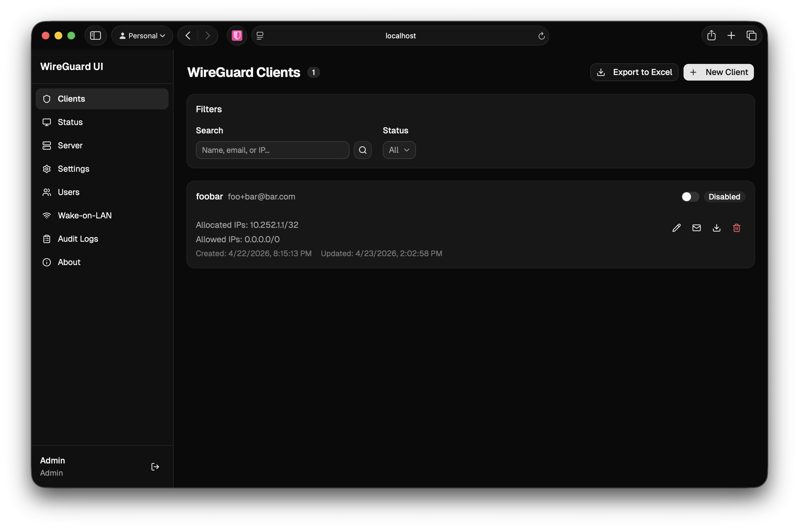

# digitaltolk/wireguard-ui

[](https://github.com/DigitalTolk/wireguard-ui/actions/workflows/ci.yml)
[](https://coveralls.io/github/DigitalTolk/wireguard-ui)

A modern web interface to manage your WireGuard VPN setup.

Fork of [ngoduykhanh/wireguard-ui](https://github.com/ngoduykhanh/wireguard-ui) by [Khanh Ngo](https://github.com/ngoduykhanh).



## Features

- Modern React frontend with [shadcn/ui](https://ui.shadcn.com/) components
- WCAG accessible, auto dark mode, mobile-friendly
- Single Sign-On via OpenID Connect (Microsoft Entra ID / any OIDC provider)
- Audit logging with Excel export (ISO 27001 evidence)
- SQLite database (pure Go, no CGO)
- Client management: QR codes, config download, email delivery
- Server-side search and filtering with bookmarkable URLs
- Input validation (frontend + backend)
- Multi-platform Docker images (linux/amd64, linux/arm64)

## Quick Start

### Docker Compose

```yaml
services:
  wireguard-ui:
    image: digitaltolk/wireguard-ui:latest
    container_name: wireguard-ui
    cap_add:
      - NET_ADMIN
    network_mode: host
    environment:
      - OIDC_ISSUER_URL=https://login.microsoftonline.com/{tenant-id}/v2.0
      - OIDC_CLIENT_ID=your-app-client-id
      - OIDC_CLIENT_SECRET=your-app-client-secret
      - OIDC_REDIRECT_URL=https://vpn.example.com/api/v1/auth/oidc/callback
      - SESSION_SECRET=change-me-to-a-random-string
      - WGUI_MANAGE_START=true
      - WGUI_MANAGE_RESTART=true
    volumes:
      - ./db:/app/db
      - /etc/wireguard:/etc/wireguard
    restart: unless-stopped
```

### Docker

```sh
docker pull digitaltolk/wireguard-ui:latest
# or from GitHub Container Registry:
docker pull ghcr.io/digitaltolk/wireguard-ui:latest
```

### Binary

Download from [Releases](https://github.com/DigitalTolk/wireguard-ui/releases):

```sh
tar xzf wireguard-ui-linux-amd64.tar.gz -C /usr/local/bin
wireguard-ui
```

## Environment Variables

### Application

| Variable | Description | Default |
|---|---|---|
| `BIND_ADDRESS` | Listen address and port | `0.0.0.0:5000` |
| `BASE_PATH` | URL base path (for reverse proxy) | `` |
| `SESSION_SECRET` | Secret key for session cookies | random |
| `SESSION_SECRET_FILE` | File containing session secret | |
| `SESSION_MAX_DURATION` | Max session lifetime in days | `1` |
| `DISABLE_LOGIN` | Disable authentication (development only) | `false` |
| `WGUI_LOG_LEVEL` | Log level: DEBUG, INFO, WARN, ERROR, OFF | `INFO` |
| `WGUI_FAVICON_FILE_PATH` | Custom favicon file path | |
| `WGUI_CONFIG_APPLY_DELAY` | Seconds to debounce config writes after mutations | `3` |

### OIDC / SSO (required for production)

| Variable | Description | Default |
|---|---|---|
| `OIDC_ISSUER_URL` | OIDC provider URL (e.g. `https://login.microsoftonline.com/{tenant}/v2.0`) | |
| `OIDC_CLIENT_ID` | OAuth2 client ID | |
| `OIDC_CLIENT_SECRET` | OAuth2 client secret | |
| `OIDC_CLIENT_SECRET_FILE` | File containing client secret | |
| `OIDC_REDIRECT_URL` | Callback URL (e.g. `https://vpn.example.com/api/v1/auth/oidc/callback`) | |
| `OIDC_SCOPES` | Comma-separated scopes | `openid,profile,email` |
| `OIDC_AUTO_PROVISION` | Auto-create users on first OIDC login | `true` |
| `OIDC_ADMIN_GROUPS` | Comma-separated group UUIDs for auto-admin | |

### WireGuard Server

| Variable | Description | Default |
|---|---|---|
| `WGUI_ENDPOINT_ADDRESS` | Public endpoint address for clients | auto-detected |
| `WGUI_SERVER_INTERFACE_ADDRESSES` | Server interface CIDR addresses | `10.252.1.0/24` |
| `WGUI_SERVER_LISTEN_PORT` | WireGuard listen port | `51820` |
| `WGUI_SERVER_POST_UP_SCRIPT` | Post-up script | |
| `WGUI_SERVER_POST_DOWN_SCRIPT` | Post-down script | |
| `WGUI_DNS` | DNS servers pushed to clients (comma-separated) | `1.1.1.1` |
| `WGUI_MTU` | MTU size | `1450` |
| `WGUI_PERSISTENT_KEEPALIVE` | Keepalive interval in seconds | `15` |
| `WGUI_FIREWALL_MARK` | Firewall mark (hex) | `0xca6c` |
| `WGUI_TABLE` | Routing table | `auto` |
| `WGUI_CONFIG_FILE_PATH` | Path to write wg0.conf | `/etc/wireguard/wg0.conf` |
| `WG_CONF_TEMPLATE` | Custom wg.conf template path | built-in |
| `SUBNET_RANGES` | Named subnet ranges (e.g. `LAN:10.0.0.0/24;REMOTE:192.168.0.0/24`) | |

### Client Defaults

| Variable | Description | Default |
|---|---|---|
| `WGUI_DEFAULT_CLIENT_ALLOWED_IPS` | Default allowed IPs for new clients | `0.0.0.0/0` |
| `WGUI_DEFAULT_CLIENT_EXTRA_ALLOWED_IPS` | Default extra allowed IPs | |
| `WGUI_DEFAULT_CLIENT_USE_SERVER_DNS` | Use server DNS by default | `true` |

### Email (SMTP)

| Variable | Description | Default |
|---|---|---|
| `SMTP_HOSTNAME` | SMTP server hostname | `127.0.0.1` |
| `SMTP_PORT` | SMTP server port | `25` |
| `SMTP_USERNAME` | SMTP username | |
| `SMTP_PASSWORD` | SMTP password | |
| `SMTP_PASSWORD_FILE` | File containing SMTP password | |
| `SMTP_HELO` | SMTP HELO hostname | `localhost` |
| `SMTP_ENCRYPTION` | NONE, SSL, SSLTLS, TLS, STARTTLS | `STARTTLS` |
| `SMTP_AUTH_TYPE` | PLAIN, LOGIN, NONE | `NONE` |
| `EMAIL_FROM_ADDRESS` | Sender email address | |
| `EMAIL_FROM_NAME` | Sender display name | `WireGuard UI` |

### Email (SendGrid)

| Variable | Description | Default |
|---|---|---|
| `SENDGRID_API_KEY` | SendGrid API key | |
| `SENDGRID_API_KEY_FILE` | File containing SendGrid API key | |

### Container Management

| Variable | Description | Default |
|---|---|---|
| `WGUI_MANAGE_START` | Start WireGuard when container starts | `false` |
| `WGUI_MANAGE_RESTART` | Restart WireGuard when config changes | `false` |

## Health Check

A health endpoint is available at `/_health` (or `{BASE_PATH}/_health` when using a base path). It returns `200 OK` with body `ok` and requires no authentication.

```sh
curl http://localhost:5000/_health
```

## Development

```sh
# Install dependencies
make deps && make deps-frontend

# Start Go backend (port 5000)
make dev

# Start frontend dev server with hot reload (port 5173)
make dev-frontend

# Run all tests
make test

# Run linters
make lint

# Build everything
make build

# Build Docker image
make docker-build
```

### Available Make Targets

```
make help            Show all commands
make build           Build frontend + Go binary
make test            Run all tests with coverage
make lint            Run Go + frontend linters
make dev             Start Go backend
make dev-frontend    Start Vite dev server
make docker-build    Build Docker image
make coverage-html   Open coverage report in browser
```

## License

MIT. See [LICENSE](LICENSE).
